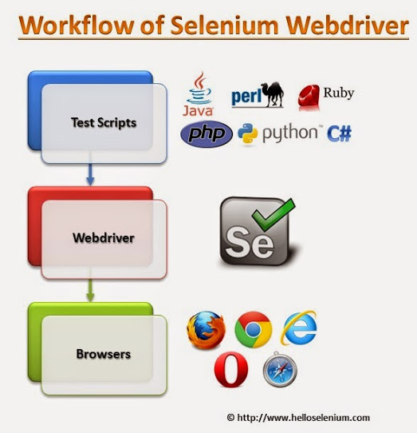
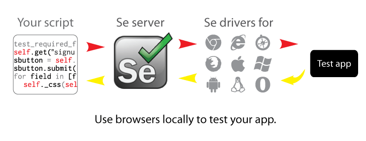
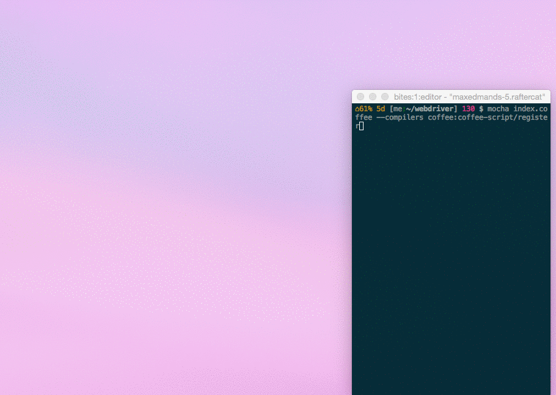

# Exposición Selenium Web Driver

# Selenium

Selenium es una herramienta que permite realizar testing sin tener que emplear un lenguaje de scripting enfocado a pruebas, también permite automatizar los navegadores web en muchas plataformas y puede ser controlado por distintos lenguajes de programación, lenguajes de dominio especifico y testing frameworks.

Un Webdriver es una interfaz de control que permite la introspección y control de agentes de usuario. Proporciona un protocolo de conexión  para para manejar remotamente el comportamiento de los navegadores web.
Permite la manipulación de los elementos del árbol DOM en los documentos web.

Es utilizado principalmente para permitir pruebas automatizadas de agente de usuario a partir de un proceso de control separado , pero también permite controlar los navegadores mediante scripts.

Figura 1 Workflow Selenium

Figura 2 Diagrama Selenium

En general Selenium esta enfocado al testing de aplicaciones web, pero también es posible automatizar tareas de administración web y cuenta con el apoyo de importantes navegares web como por ejemplo Mozilla Firefox.

Figura 3 Ejemplo Selenium visualmente
## Tutorial

En el tutorial se utilizará la práctica Conversor de Temperatura realizada con anterioridad.

Se debe crear la estructura de la aplicación con Express-Generator, o en si lo prefiere usar la de la práctica 5.

#### Paquetes importantes a instalar

        npm install --save
        selenium-webdriver@2.48.2
        mocha@2.3.3
        chai@"3.4.1
        chai-as-promised@5.1.0
        coffee-script@ "1.10.0

Una vez se ha creado la estructura de la aplicación, se procede a crear un directorio 'tests' y donde se almacenarán los ficheros que contienen el código que realizará los test a nuestra aplicación.

Se crea el fichero test.coffee  y se añade:

Importación modulos necesarios

          webdriver = require 'selenium-webdriver'
          chai = require 'chai'
          chai.use require 'chai-as-promised'
          expect = chai.expect

Se especifica que webdriver se va a utilizar, con que navegador.

          before ->
            @timeout 10000
            @driver = new webdriver.Builder()
              .withCapabilities(webdriver.Capabilities.firefox())
              .build()
            @driver.getWindowHandle()

Despues de finalizar las pruebas, se cierra y limpia el navegador.

          after ->
            @driver.quit();

Despues se empieza a poner los test dentro del bloque describe, para que estén en un lugar lógico.

        describe 'Webdriver tutorial', ->
          ###
          ... Some tests ...
          ###

e.g. :
Ir a una página

        it 'Should let me go to the URL and see the page\'s title', ->
          @driver.get 'google.com'
          @timeout 5000
          expect(@driver.getTitle()).to.eventually.contain 'Google'

Manipular elementos árbol DOM

          @driver.findElement(linkText: 'Imagenes')
          @driver.findElement(xpath: '//[@id="content"]/div/article/div/pre[1]')
          @driver.findElement(js: 'return document.getElementById("Result")')
          @driver.findElement(id: 'labelID')
          @driver.findElement(name: 'consulta')

Interactuar con la págetWindowHandle

          it 'links back to the Google\'s index, ->
            @driver.findElement(linkText: 'Google').click()
            expect(@driver.getCurrentUrl()).to.eventually.equal 'http://www.google.com/'

Una vez se tengan los test implementados se corren con el comando:

        mocha tests/test.coffee --compilers coffee:coffee-script/register

Es posible se abra un navegador y se mueva solo, ver Figura 3.
En el caso de tener la aplicación corriendo en un servidor sin desktop environtment es necesario emular un navegador, para esto es necesario installar un X virtual framebuffer:

        apt-get install Xvfb

Se debe instalar también un navegador que en nuestro caso es Firefox
En la ruta

        /etc/apt/sources.list

Como root añadir

      ppa:mozillateam/firefox-stable

Seguido se actualiza e instala

      sudo apt-get update
      sudo apt-get install firefox

Una vez todo instalado, se procede a correr Xvfb en una terminal, para este tutorial asumimos un display, 10.

      sudo Xvfb :10 -ac

Se mínimiza esta terminal.

Antes de ejecutar las pruebas es necesario establecer la variable de ambiente DISPLAY

      export DISPLAY=:10

Se ejecutan los test

        mocha tests/test.coffee --compilers coffee:coffee-script/register

##### About Me

    José Joaquín Escobar Gómez.
    Estudiante Ing. Informática
    quinoescobar@gmail.com
    Universidad de La Laguna
    San Cristóbal de La Laguna - España

##### Referencias

* Enlace página [Selenium](http://www.seleniumhq.org/)

* Enlace página [guía de usuario selenium-webdriver](https://code.google.com/p/selenium/wiki/WebDriverJs#Writing_Tests)

* Enlace página [Coffee Script](http://coffeescript.org/)

* Enlace página [Chai](http://chaijs.com/api/bdd/)

* Enlace página [Chai-as-promised](https://github.com/domenic/chai-as-promised/)

* Enlace página [Mocha](http://mochajs.org/)

* Enlace Repositorio  [SeleniumExpo](https://quinoescobar.github.io/SeleniumExpo)

* Enlace página author [Quinoescobar](https://quinoescobar.github.io)
